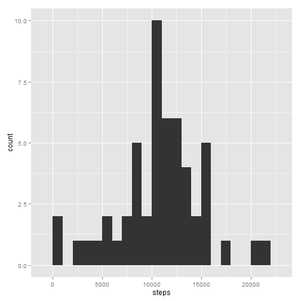
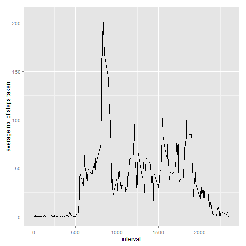
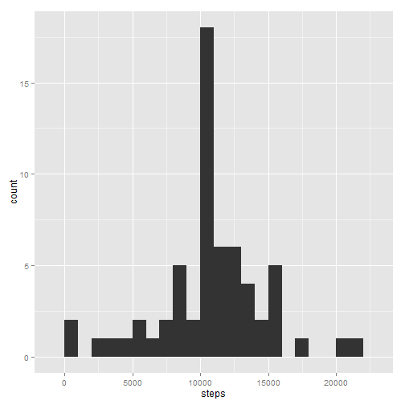
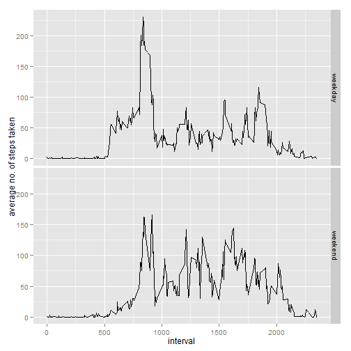

# Reproducible Research: Peer Assessment 1


## Loading and preprocessing the data

```r
# required libraries
library(ggplot2)
# set working directory (you will need to use path to your working directory)
setwd("c:/Users/karmacha/Documents/workshop/coursera/repdata-005/RepData_PeerAssessment1/")
# read data file
dat <- read.csv("activity.csv")
# convert date string to date format
dat$date <- as.Date(dat$date, format="%Y-%m-%d")
```

## What is mean total number of steps taken per day?

```r
# aggregate the steps for histogram and plot the graph
# missing values are ignored for this part
agg <- aggregate(steps~date, data=dat, FUN=sum, na.action=na.omit)
qplot(steps, data=agg, geom="histogram", binwidth=1000)
```

 

```r
mean(agg$steps)
```

```
## [1] 10766
```

```r
median(agg$steps)
```

```
## [1] 10765
```

## What is the average daily activity pattern?

```r
# aggregate the step as average across days for each interval
# missing values are ignored for this part
agg <- aggregate(steps~interval, data=dat, FUN=mean, na.action=na.omit)
qplot(interval, steps, data=agg, geom="line", ylab="average no. of steps taken")
```

 

```r
# interval with the maximum average no. of steps taken
agg$interval[agg$steps == max(agg$steps)]
```

```
## [1] 835
```

## Imputing missing values

```r
# total no. of missing values (using summary)
summary(dat)
```

```
##      steps            date               interval   
##  Min.   :  0.0   Min.   :2012-10-01   Min.   :   0  
##  1st Qu.:  0.0   1st Qu.:2012-10-16   1st Qu.: 589  
##  Median :  0.0   Median :2012-10-31   Median :1178  
##  Mean   : 37.4   Mean   :2012-10-31   Mean   :1178  
##  3rd Qu.: 12.0   3rd Qu.:2012-11-15   3rd Qu.:1766  
##  Max.   :806.0   Max.   :2012-11-30   Max.   :2355  
##  NA's   :2304
```

```r
# total no. of missing values (calculated)
sum(is.na(dat$steps))
```

```
## [1] 2304
```

```r
# using average no. of steps for the interval to fill in missing values
# merging original dataset with aggregate data
mdat <- merge(dat, agg, by="interval")
# replacing NAs with averages for the interval from the aggregated data
mdat$steps.x[is.na(mdat$steps.x)] <- mdat$steps.y[is.na(mdat$steps.x)]
# reformatting the new dataset
mdat <- mdat[, 1:3]
names(mdat) <- c("interval", "steps", "date")
# plotting histogram of steps
magg <- aggregate(steps~date, data=mdat, FUN=sum)
qplot(steps, data=magg, geom="histogram", binwidth=1000)
```

 

```r
mean(magg$steps)
```

```
## [1] 10766
```

```r
median(magg$steps)
```

```
## [1] 10766
```
There isn't much impact of imputing missing data. The median has increased by 1.  

## Are there differences in activity patterns between weekdays and weekends?

```r
# flagging weekdays and weekends
mdat$daytype[weekdays(mdat$date) %in% c("Saturday", "Sunday")] <- "weekend"
mdat$daytype[!weekdays(mdat$date) %in% c("Saturday", "Sunday")] <- "weekday"
mdat$daytype <- factor(mdat$daytype)
# aggregate the step as average across days for each interval
# missing values are ignored for this part
magg <- aggregate(steps~interval+daytype, data=mdat, FUN=mean)
qplot(interval, steps, data=magg, facets=daytype~., geom="line", ylab="average no. of steps taken")
```

 


